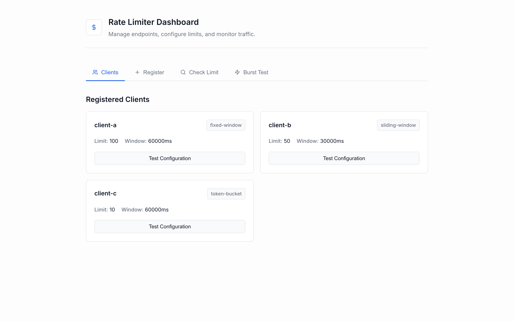

# Rate Limiter Service

A high-performance, configurable Rate Limiter built with **Node.js, Fastify, Redis, and PostgreSQL**. Designed to protect your APIs by strictly managing traffic and preventing abuse, and it includes a built-in interactive dashboard to configure and test rate limits in real-time.



---

## Features

- **Blazing Fast API**: Powered by Fastify and Redis.
- **Multiple Algorithms Supported**:
  - **Fixed Window**: The simplest approach. A fixed window of time where requests are counted.
  - **Sliding Window**: A smoother approach using Redis Sorted Sets to count requests exactly within the rolling time window.
  - **Token Bucket**: A steady rate approach ideal for bursts, refilling a set amount of tokens over time.
- **Dynamic Configuration**: Rate limits are configured per-client and stored in PostgreSQL, with aggressive caching in Redis.
- **Interactive UI Dashboard**: Manage clients, check limits, and execute burst tests visually from your browser!

---

## Tech Stack

- **Backend Framework**: [Fastify](https://www.fastify.io/)
- **Language**: [TypeScript](https://www.typescriptlang.org/)
- **In-Memory Store (Cache & Counting)**: [Redis](https://redis.io/)
- **Persistent Storage (Analytics & Config)**: [PostgreSQL](https://www.postgresql.org/)
- **Frontend Dashboard**: Vanilla HTML/CSS/JS (served statically)

---

## Getting Started

### 1. Prerequisites

You need **Node.js**, **pnpm**, **PostgreSQL**, and **Redis** running on your local machine.

_(Need a quick DB setup? Use the included `docker-compose.yml` to spin up Postgres and Redis instantly: `docker-compose up -d`)_

### 2. Installation

Clone the repo and install the dependencies:

```bash
git clone <your-repo-url>
cd rate-limiter
pnpm install
```

### 3. Environment Variables

Ensure you have a `.env` file in the root of the project with your database and redis credentials. There is a `.env` already provided for local setup running on default ports.

### 4. Database Setup

Run the migrations and seed the database with sample clients:

```bash
pnpm migrate
pnpm seed
```

### 5. Running the Application

Start the development server:

```bash
pnpm dev
```

The server will now be running at `http://localhost:3000`.

---

## The Dashboard GUI

Instead of writing `curl` commands, we shipped a stunning, modern **Rate Limiter Dashboard** built right into the app.

Once your server is running, just open **[http://localhost:3000](http://localhost:3000)** in your browser!

### Dashboard Features:

- **Clients**: See all your registered API consumers, their assigned algorithms, and max request limits.
- **Register**: Create new clients on the fly with custom time windows, algorithms, and refill rates.
- **Check Limit**: Test access and view whether a request is Allowed/Blocked along with the remaining quota limit.
- **Burst Test Simulator**: Rapidly fire requests to visually see the exact moment the rate limiter catches and blocks traffic in a real-time scrolling log.

---

## API Documentation

The server exposes the following REST endpoints:

### GET `/health`

Check if the server is healthy.

### GET `/clients`

Retrieves a list of all registered clients and their rate-limit rules.

### POST `/clients`

Register a new client configuration.

```json
// Example Request Body
{
  "clientId": "web-app-prod",
  "algorithm": "sliding-window",
  "limit": 50,
  "windowMs": 30000
}
```

### POST `/check`

The core endpoint to verify if a request should be allowed through.

```json
// Example Request Body
{
  "clientId": "web-app-prod",
  "endpoint": "/api/payments"
}
```

**Response (200 OK - Allowed)**

```json
{
  "allowed": true,
  "remaining": 49,
  "limit": 50,
  "resetAt": "2026-03-21T09:00:30.000Z"
}
```

**Response (429 Too Many Requests - Blocked)**

```json
{
  "allowed": false,
  "remaining": 0,
  "limit": 50,
  "resetAt": "2026-03-21T09:00:30.000Z"
}
```

---

## 📝 License

This project is licensed under the MIT License - see the LICENSE file for details.
